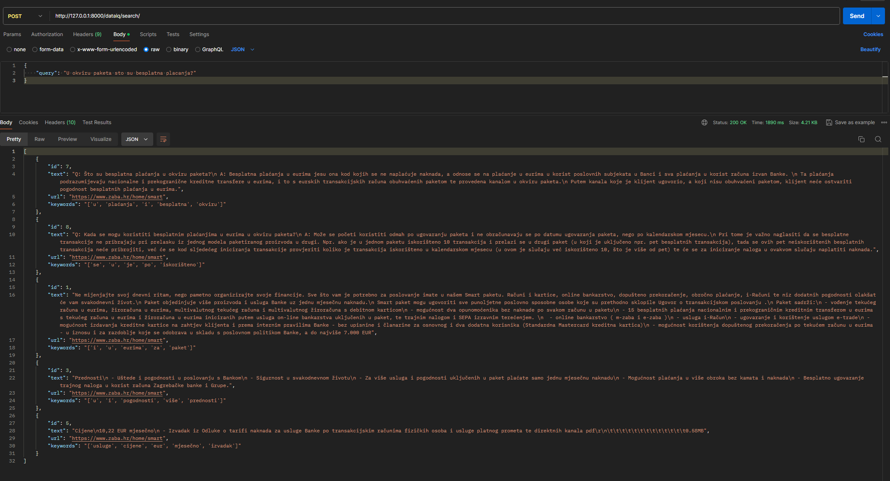

# ZabaPoC

## Introduction

This project is a Django-based web application that processes and parses data from the Zaba website. The application is containerized using Docker to ensure a consistent and reproducible environment.

## Prerequisites

Before you begin, ensure you have the following installed on your local machine:

- [Docker](https://docs.docker.com/get-docker/)
- [Docker Compose](https://docs.docker.com/compose/install/)

## Getting Started

Follow the steps below to set up and run the project:

### 1. Clone the Repository

```bash
git clone <repository-url>
cd <repository-directory>
```

Replace <repository-url> with the URL of your repository and <repository-directory> with the name of the cloned directory.

### 2. Start Docker Containers

To start the project, run the following command:

```bash
docker-compose up
```
This command will build and start all the necessary Docker containers as specified in the docker-compose.yml file.

### 3. Apply Database Migrations
Once the containers are running, you need to apply the database migrations.

#### Option 1: Run from inside of Django container
Check container names:
```bash
docker ps
```

```bash
docker exec -it <container_name> bash
```

Inside the container, run:

```bash
python manage.py migrate
```

### 4. Parse and chunk data
Next, you need to parse and chunk the data from the Zaba website. This process involves downloading models (if not already available) and parsing the website content.

#### Run from inside of Django container
```bash
docker exec -it <container_name> bash
```

Inside the container, run:

```bash
python manage.py parse_and_chunk
```


### 5. Test the output
After the parsing and chunking process is complete, you can test the output using the provided data. You can use a tool like Postman to make API requests and verify the results.


Output should look something like this (first item in list is the one with the biggest vector similarity):
